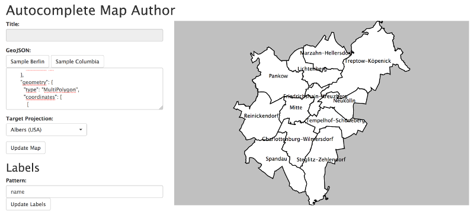

#  Autocomplete Map Author (WIP)

enables everyone to create autocomplete maps à la "Why is [] so ..."

## Basic Concept

1. user uploads GeoJSON file with Geometries and Properties
   => GeoJSON is displayed on the map
2. user defines the phrase which has to gets autocompleted as "Why is ${name} so ..."
   => Googles Suggestion API is getting requested for every Feature
   => Geometries are filled with labels

## Things To Clarify

1. AngularJS vs. EmberJS vs. Plain JS vs. Apache Wicket vs...  
   => Bootstrap, RiotJS, ReduxJS
2. easy peasy D3 vs. MapboxGL 
   -> plain D3 offers more freedom in map projections 
   -> plain D3 offers more freedom in label placement 
   -> D3 SVG overlay over MapboxGL? 
   => D3 for first solution!
3. Suggestion on front-end or back-end side? 
   => first solution front-end only!
4. Where to upload the files? 
   -> Dropbox / S3 / maybe on Heroku 
   => GeoJSON textfield for first solution!
5. Application hosting on Heroku? 
   => why not? 
   => Heroku!

# Technical

## start

1. `npm run start`
2. open http://localhost:3000 
